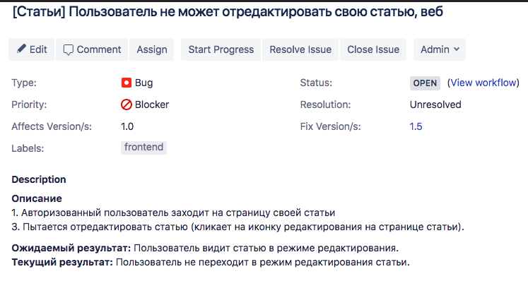

# Как правильно создать баг?

## Обязательные поля при создании бага:

1. Тип задачи (Issue Type) - Bug
2. Тема (Summary)

В одном предложении надо уместить смысл всего баг-репорта, а именно: коротко и ясно, используя правильную терминологию сказать что не работает, по принципу Что? Где? Когда? [Над какой feature работаете?] Где - произошла - ошибка?: Что произошло? Когда/при каких условиях?

**Пример:**
* _Пользователь не может отредактировать свою статью, веб_
* _Исправить валидацию поля для CVV кода карты, увеличив количество цифр до 4 (кейс American Express)_

3. Приоритет (Priority): Blocker, Critical, Medium, Minor. [Инструкция по определению приоритета бага](bugs-priorities.md).
4. Ответственный (Assignee)
5. Описание баг-репорта (Description):
 - предварительные условия / шаги (Preconditions),
 - шаги к воспроизведению (Steps to Reproduce),
 - окружение (если имеет значение; если не знаете — лучше указать),
 - реальный результат (Actual Result),
 - ожидаемый результат (Expected Result).
 - логи, скриншоты, видео-скриншоты, ссылки (на отчеты об ошибке, на стори или спецификации).

 Пример описания бага:

